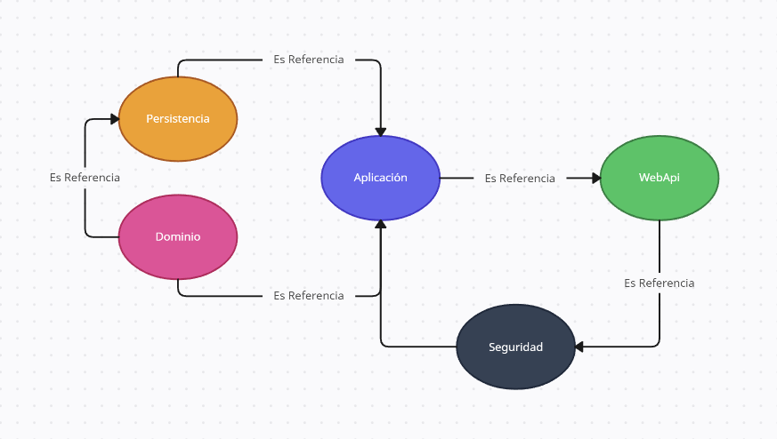

---
<div style="background-image: url(https://media3.giphy.com/media/wwg1suUiTbCY8H8vIA/giphy.gif?cid=ecf05e47hfu84pmh8vk2mo5wohm7vxo4hcx1gu3ye1664zcy&ep=v1_gifs_search&rid=giphy.gif&ct=g); display: flex; justify-content: center;">

# Sicer Andres Brito Gutierrez 🧑‍💻 Proyecto WebApi Campuslands 
</div>


<div style="display: flex; justify-content: center;">

## Proyecto WebApi Campuslands hecho por [Sicer Brito 🧑‍💻](https://github.com/SicerBrito)
</div>


# Índice 📖
En esta ocasión voy a realizar un proyecto personal junto con su documentacion con el objetivo de mejorar mis habilidades en .Net

- [Documentación](#documentación) 📄
    - [Estructura del Proyecto](#estructura-del-proyecto) 🏗️
    - [Terminal](#terminal) ⚙️
        - [Estructura Base](#estructura-base) 🚧
        - [Referencias](#referencias) 🔗
    - [Gestión de Datos](#gestión-de-datos) 📇
        - [Instalacion de Paquetes](#instalacion-de-paquetes) ⏬
            - [Dominio](#dominio) 📂
            - [Persistencia](#persistencia) 📂
            - [WebApi](#webapi) 📂
        - [Migraciones](#migraciones) ✈️
            - [Crear](#crear) 🔧
            - [Actualizar](#actualizar) 🔧
        - [Visualización de posibles errores](#visualización-de-posibles-errores) ⁉️


---
# Documentación
Proyecto WebApi Campuslands con la estructura que tiene [Solvo](https://solvoglobal.com/)  
Mi objetivo con este proyecto es centrarme en el aprendizaje y el desarrollo constante de mis habilidades. Además de eso, también tengo otras metas en mente para asegurarme de que mi contribución sea lo más efectiva posible 📄  

## Estructura del Proyecto
Estas son las carpertas de configuracion las cuales vamos a utilizar para nuestros proyectos
 - 📂 En Dominio  
        Aqui se crean las tablas que representan la BD y van a estar ubicadas las carpetas de Entidades e Interfaces.

 - 📂 En Persistencia  
        Aqui se crea la instancia de conexion a la BD y van a estar ubicadas las carpetas de Data, Configuracion, Archivo context y Migraciones.

 - 📂 En Aplicacion  
        Aqui se crea la inyeccion de dependecia para la comunicacion con el WebApi y van a estar ubicadas las carpetas de Unidad de trabajo y Repositorios.
        
 - 📂 En WebApi  
        Aqui se crean clases encargadas de recibir peticiones de los clientes y van a estar ubicadas las carpetas de Controladores, helpers, Dtos, Profile, Contenedor de dependecias(program.cs) y Extenciones.

---

   

---


## Terminal

 - ### Estructura Base

    ```Terminal
    1. dotnet tool install --global dotnet-ef 🚧🔧
        --> instala la herramienta "dotnet-ef" globalmente para trabajar con Entity Framework Core.

    2. dotnet tool list -g 🚧🔧
        --> Lista las herramientas globales instaladas en .NET.
        --> En caso de no estar desactualizado se puede actualizar mediante este comando (dotnet tool update --global dotnet-ef)

    3. dotnet new sln 🚧🔧
        --> Crea una nueva solución de .NET.
            (Una solución (.sln) se refiere a un archivo que actúa como un contenedor para organizar y administrar proyectos relacionados en un entorno de desarrollo de .NET)

    4. dotnet new classlib -o Dominio 🚧🔧
        --> Crea un nuevo proyecto de biblioteca de clases utilizando .NET Core y lo guarda en la carpeta "Dominio". Las bibliotecas de clases son conjuntos de código reutilizable que pueden ser referenciados y utilizados en otros proyectos .NET Core. En este caso, el nombre "Dominio" sugiere que esta biblioteca podría contener clases y lógica relacionada con el dominio central de la aplicación, como modelos y reglas de negocio

    5. dotnet new classlib -o Persistencia 🚧🔧
        --> Crea un nuevo proyecto de biblioteca de clases utilizando .NET Core y lo guarda en la carpeta "Persistencia". Las bibliotecas de clases son conjuntos de código reutilizable que pueden ser referenciados y utilizados en otros proyectos .NET Core. En este caso, el nombre "Persistencia" sugiere que esta biblioteca podría contener clases y lógica relacionada con el acceso y la manipulación de datos, como el uso de bases de datos y almacenamiento persistente.

    6. dotnet new classlib -o Aplicacion 🚧🔧
        --> Crea un nuevo proyecto de biblioteca de clases utilizando .NET Core y lo guarda en la carpeta "Aplicacion". Las bibliotecas de clases son conjuntos de código reutilizable que pueden ser referenciados y utilizados en otros proyectos .NET Core. En este caso, el nombre "Aplicacion" sugiere que esta biblioteca podría contener clases y lógica relacionada con la capa de aplicación, como la implementación de casos de uso y la interacción con la interfaz de usuario.

    7. dotnet new webapi -o DinoApi 🚧🔧
        --> Crea un nuevo proyecto de API web utilizando .NET Core y lo guarda en la carpeta "DinoApi". Este comando establece las bases para crear una API utilizando el framework .NET Core, que puede ser utilizada para exponer servicios a través de HTTP.

    8. dotnet sln add Dominio/ 🚧🔧
        --> Agrega el proyecto ubicado en la carpeta "Dominio" al archivo de solución actual de .NET Core. Esto permite incluir el proyecto "Dominio" dentro de la solución y facilita la gestión de múltiples proyectos en un mismo contexto de desarrollo. Es útil cuando se tiene una solución que consta de varios proyectos y se quiere mantener todo organizado en una estructura de solución.

    9. dotnet sln add Persistencia/ 🚧🔧
        --> Agrega el proyecto ubicado en la carpeta "Persistencia" al archivo de solución actual de .NET Core. Esto permite incluir el proyecto "Persistencia" dentro de la solución y facilita la gestión de múltiples proyectos en un mismo contexto de desarrollo. Es útil cuando se tiene una solución que consta de varios proyectos y se quiere mantener todo organizado en una estructura de solución.

    10. dotnet sln add Aplicacion/ 🚧🔧
        --> Agrega el proyecto ubicado en la carpeta "Aplicacion" al archivo de solución actual de .NET Core. Esto permite incluir el proyecto "Aplicacion" dentro de la solución y facilita la gestión de múltiples proyectos en un mismo contexto de desarrollo. Es útil cuando se tiene una solución que consta de varios proyectos y se quiere mantener todo organizado en una estructura de solución.

    11. dotnet sln add DinoApi/ 🚧🔧
        --> Agrega el proyecto ubicado en la carpeta "DinoApi" al archivo de solución actual de .NET Core. Esto permite incluir el proyecto "DinoApi" dentro de la solución y facilita la gestión de múltiples proyectos en un mismo contexto de desarrollo. Es útil cuando se tiene una solución que consta de varios proyectos y se quiere mantener todo organizado en una estructura de solución.

    ```
---

 - ### Referencias

    ```Terminal
    1. cd Aplicacion/ 🔗🔧
        - dotnet add reference ../Dominio/
            --> Agrega una referencia al proyecto "Dominio" desde el proyecto "Aplicacion". Al hacer esto, el proyecto "Aplicacion" podrá acceder y utilizar las clases y funcionalidades proporcionadas por el proyecto "Dominio". Esto es útil cuando se tiene una estructura de capas en la que el proyecto de aplicación depende de lógica y modelos definidos en el proyecto de dominio.
        - dotnet add reference ../Persistencia/
            --> Agrega una referencia al proyecto "Persistencia" desde el proyecto "Aplicacion". Al hacer esto, el proyecto "Aplicacion" podrá acceder y utilizar las clases y funcionalidades proporcionadas por el proyecto "Persistencia". Esto es útil cuando se tiene una estructura de capas en la que el proyecto de aplicación necesita interactuar con la capa de persistencia, por ejemplo, para realizar operaciones de acceso a base de datos.
    
    2. cd DinoApi/ 🔗🔧
        - dotnet add reference ../Aplicacion/
            --> Agrega una referencia al proyecto "Aplicacion" desde el proyecto "DinoApi". Al hacer esto, el proyecto "DinoApi" podrá acceder y utilizar las clases y funcionalidades proporcionadas por el proyecto "Aplicacion". Esto es útil cuando se tiene una estructura de capas en la que el proyecto de la API necesita interactuar con la capa de aplicación para exponer funcionalidades a través de la interfaz de la API.

    3. cd Persistencia/ 🔗🔧
        - dotnet add reference ../Dominio/
            --> Agrega una referencia al proyecto "Dominio" desde el proyecto "Persistencia". Al hacer esto, el proyecto "Persistencia" podrá acceder y utilizar las clases y funcionalidades proporcionadas por el proyecto "Dominio". Esto es útil cuando se tiene una estructura de capas en la que el proyecto de persistencia necesita acceder a los modelos y reglas de negocio definidos en el proyecto de dominio.

    ```
---


---


## Gestión de Datos

- ### Instalacion de Paquetes

    - ### Dominio

        - dotnet add package Microsoft.EntityFrameworkCore --version 7.0.10  📂🔧

            Agrega el paquete "Microsoft.EntityFrameworkCore" con la versión 7.0.10 al proyecto actual. Entity Framework Core es una biblioteca popular para el acceso a bases de datos en proyectos .NET Core, y esta instrucción instalará la versión específica 7.0.10 de dicha biblioteca en el proyecto. Esto permitirá al proyecto utilizar Entity Framework Core para interactuar con bases de datos.

            ---

        - dotnet add package MediatR.Extensions.Microsoft.DependencyInjection --version 11.1.0  📂🔧

           Agrega el paquete "MediatR.Extensions.Microsoft.DependencyInjection" con la versión 11.1.0 al proyecto actual. MediatR es una biblioteca que implementa el patrón Mediator para la comunicación entre componentes en aplicaciones .NET, y este paquete proporciona integración con la inyección de dependencias de Microsoft.

            ---

        - dotnet add package AutoMapper.Extensions.Microsoft.DependencyInjection --version 12.0.1  📂🔧

           Agrega el paquete "AutoMapper.Extensions.Microsoft.DependencyInjection" con la versión 12.0.1 al proyecto actual. Este paquete proporciona extensiones para el framework AutoMapper que permiten una fácil integración con la inyección de dependencias de Microsoft.

            ---

        - dotnet add package FluentValidation.AspNetCore --version 11.3.0  📂🔧

           Agrega el paquete "FluentValidation.AspNetCore" con la versión 11.3.0 al proyecto actual. FluentValidation es una biblioteca que permite realizar validaciones en modelos de forma sencilla y declarativa, y este paquete proporciona integración con ASP.NET Core.

            ---

        - dotnet add package itext7.pdfhtml --version 5.0.1  📂🔧

           Agrega el paquete "itext7.pdfhtml" con la versión 5.0.1 al proyecto actual. Este paquete pertenece a iText 7, una biblioteca utilizada para trabajar con archivos PDF en aplicaciones .NET. En particular, "itext7.pdfhtml" es una extensión de iText 7 que permite convertir documentos HTML a PDF.

            ---


    - ### Persistencia 

        - dotnet add package Microsoft.EntityFrameworkCore --version 7.0.10  📂🔧

           Agrega el paquete "Microsoft.EntityFrameworkCore" con la versión 7.0.10 al proyecto actual. Entity Framework Core es una biblioteca popular para el acceso a bases de datos en proyectos .NET Core, y esta instrucción instalará la versión específica 7.0.10 de dicha biblioteca en el proyecto. Esto permitirá al proyecto utilizar Entity Framework Core para interactuar con bases de datos.

            ---

        - dotnet add package Pomelo.EntityFrameworkCore.MySql --version 7.0.0  📂🔧

           Agrega el paquete "Pomelo.EntityFrameworkCore.MySql" con la versión 7.0.0 al proyecto actual. Este paquete proporciona soporte para MySQL en Entity Framework Core y es una opción popular para interactuar con bases de datos MySQL en proyectos .NET Core.

            ---

        - dotnet add package Microsoft.EntityFrameworkCore.Tools --version 7.0.10  📂🔧

           Agrega el paquete "Microsoft.EntityFrameworkCore.Tools" con la versión 7.0.10 al proyecto actual. Este paquete proporciona herramientas adicionales para trabajar con Entity Framework Core, incluyendo comandos para realizar migraciones de base de datos y generar código a partir de modelos.

            ---

        - dotnet add package Dapper --version 2.0.151  📂🔧

           Agrega el paquete "Dapper" con la versión 2.0.143 al proyecto actual. Dapper es una biblioteca que facilita el acceso y la manipulación de bases de datos en aplicaciones .NET mediante consultas SQL. Proporciona una forma sencilla y eficiente de mapear resultados de consultas a objetos.

            ---


    - ### WebApi 

        - dotnet add package Microsoft.EntityFrameworkCore.Design --version 7.0.10  📂🔧

           Agrega el paquete "Microsoft.EntityFrameworkCore.Design" con la versión 7.0.10 al proyecto actual. Este paquete proporciona herramientas de diseño para Entity Framework Core, que son útiles para trabajar con bases de datos y realizar migraciones en proyectos .NET Core.

            ---

        - dotnet add package Newtonsoft.Json --version 13.0.3  📂🔧

           Agrega el paquete "Newtonsoft.Json" con la versión 13.0.3 al proyecto actual. Newtonsoft.Json es una biblioteca muy utilizada para trabajar con formato JSON en aplicaciones .NET. Proporciona funciones para serializar y deserializar objetos en formato JSON.

            ---

        - dotnet add package Microsoft.AspNetCore.Authentication.JwtBearer --version 7.0.10  📂🔧

           Agrega el paquete "Microsoft.AspNetCore.Authentication.JwtBearer" con la versión 7.0.10 al proyecto actual. Este paquete proporciona funcionalidad para la autenticación basada en tokens JWT (JSON Web Tokens) en aplicaciones ASP.NET Core.

            ---

        - dotnet add package Swashbuckle.AspNetCore --version 6.5.0  📂🔧

           Agrega el paquete "Swashbuckle.AspNetCore" con la versión 6.5.0 al proyecto actual. Swashbuckle.AspNetCore es una biblioteca que permite generar automáticamente una documentación interactiva (Swagger UI) para tu API ASP.NET Core, lo que facilita la exploración y prueba de los endpoints de la API.

            ---


- ### Migraciones    
    Se deben utilizar estos comandos para poder aplicar las migraciones y que los cambios se guarden en la base de datos ✈️🔧

    - ### Crear  
        - dotnet ef migrations add InitialCreate --project ./Persistencia/ --startup-project ./ApiIncidencias/ --output-dir ./Data/Migrations/  ✈️🔧  

            Este comando genera una migración inicial llamada "InitialCreate" utilizando Entity Framework Core. Las migraciones permiten mantener sincronizada la estructura de la base de datos con los cambios en el modelo de datos en proyectos .NET Core.

        ---

    - ### Actualizar
        - dotnet ef database update --project ./Persistencia/ --startup-project ./ApiIncidencias/  ✈️🔧  

            Este comando aplica las migraciones pendientes en la base de datos, lo que implica actualizar la estructura de la base de datos para que coincida con el estado actual del modelo de datos en los proyectos .NET Core involucrados.

        ---

- ### Visualización de posibles errores  
    Este comando se utiliza para construir (compilar) los proyectos en sus respectivos directorios, una ventaja que posee este comando es que nos permite ver que errores podemos tener a la hora de complilar 🏗️

    - dotnet build 🏗️  
        Compila el proyecto ubicado en el directorio actual. Esto significa que el código fuente del proyecto se compilará en ensamblados ejecutables, bibliotecas u otros tipos de archivos de salida según la configuración del proyecto.  

        **Ejemplos:**

        - dotnet build ./Infrastructure/  🏗️

            Compila el proyecto ubicado en la carpeta "Infrastructure". Esto significa que el código fuente del proyecto se compilará en ensamblados ejecutables, bibliotecas o archivos de salida según la configuración del proyecto.

            ---
        - dotnet build ./API/  🏗️

            Compila el proyecto ubicado en la carpeta "API". Esto significa que el código fuente del proyecto se compilará en ensamblados ejecutables, bibliotecas o archivos de salida según la configuración del proyecto.

            --- 
---

   


